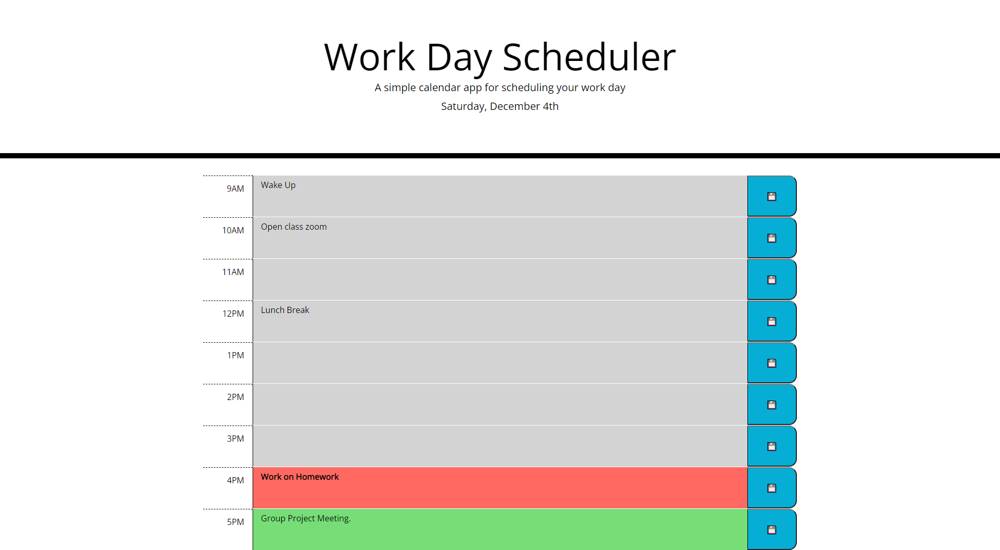

# Work Day Scheduler

## Contributor - Chris Kimball

### Description
---------------

The following project is a web application that allows the user to organize their daily work schedule by allowing them to save events to a daily planner.

Upon initial page load the user will presented with the current date, and time blocks from 9AM to 5PM (all times are the user's local time). Each time block is clearly labeled, has a text box to input an event or notes, and a blue save button.

When the save button is clicked the contents of the text box will be saved to the user's local storage on their machine which allows them to see the saved events when returning to the page.

If a user wants to clear out the saved event, they just need to clear out the text from the corresponding text box and save the blank value to save it to their local storage.

Timeblocks will be color coded based off the current hour of page load to indicate whether the timeblock is in the past, present or future. Timeblocks and events in the past will have a grey background. Future timeblocks will have a green background. And the timeblock for the current hour will have a red background and the event text in bold to indicate to the user that it is important they complete the scheduled event/task.

### Technologies used
---------------

The functionality behind this website would not be possible without the following technologies:
* [Bootstrap HTML elements and CSS styling](https://getbootstrap.com/ "Bootstrap homepage")
* [jQuery Library](https://jquery.com/ "jQuery homepage")
* [Moment.js](https://momentjs.com/ "Moment.js homepage")
* Javascript
* HTML / CSS

### Web addresses
---------------

*  [Deployed Website](https://chriskimball.github.io/work-scheduler-so182s/ "Work Day Scheduler")

*  [Github Repository](https://github.com/chriskimball/work-scheduler-so182s "Github Repo")

### Installation
---------------

1. Clone this Git repository
2. Navigate to repository in local directory.
3. Open index.html on default web browser.

### Screenshots
---------------

### Copyright Info
---------------

© 2021 Trilogy Education Services, LLC, a 2U, Inc. brand. Confidential and Proprietary. All Rights Reserved.